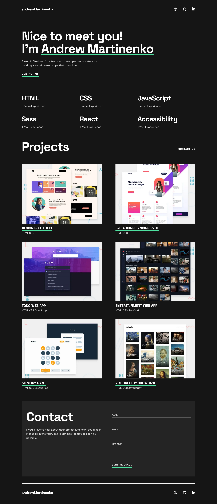

# Single-page developer portfolio / Codecademy Project

This is a solution to the **"Single-page developer portfolio"** project from Codecademy.

The project focuses on building a modern, responsive single‑page portfolio for a frontend developer.

---

## Table of contents
- [Overview](#overview)
- [Project Goals](#project-goals)
- [Features](#features)
- [Screenshot](#screenshot)
- [Links](#links)
- [Built With](#built-with)
- [Author](#author)
- [License](#license)

---

## Overview

This project is a **single-page developer portfolio website** created as part of the Codecademy Front-End Engineer path.
It showcases frontend development skills, selected projects, and contact information, while following modern web standards and accessibility practices.

The main focus is on:

* Clean and minimal UI design
* Semantic and accessible HTML structure
* Responsive layout for all screen sizes
* Optimized performance and loading behavior

---

## Project Goals

* Build a professional **developer portfolio** as a single-page website.
* Practice using **semantic HTML5** and clean CSS architecture.
* Implement a fully **responsive layout** with a mobile‑first approach.
* Improve **accessibility** using proper ARIA attributes and heading structure.
* Optimize performance with efficient asset loading strategies.
* Use **Git & GitHub** for version control and project deployment.

---

## Features

* **Hero section** with name, role and call‑to‑action.
* **Skills section** with structured list of technologies.
* **Projects showcase** with screenshots and live/code links.
* **Contact section** with accessible form and contact links.
* **JavaScript** module responsible for form validation and submission handling.
* Fully **responsive design** for desktop, tablet and mobile.
* **SEO-optimized head** with proper meta and Open Graph tags.
* Accessibility improvements: semantic markup, alt text, ARIA labels.

---

## Screenshot

---

## Links

* **Project Description:** [Codecademy Portfolio Project](https://www.codecademy.com/journeys/front-end-engineer/paths/fecj-22-building-interactive-websites/tracks/fecj-22-html-portfolio-project-personal-portfolio-website/modules/wdcp-22-personal-portfolio-project-21965fcf-f975-4849-8103-ac20ba18e97d/kanban_projects/portfolio-website)
* **Live Demo:** [Live Page URL](https://axinitm.github.io/Portfolio-Website/)
* **Source Code:** [GitHub Repo](https://github.com/AxinitM/Portfolio-Website)

---

## Built With

* Semantic **HTML5**
* Modern **CSS3** (Flexbox, custom properties)
* Responsive layout (mobile‑first approach)
* Accessibility best practices (ARIA, landmarks)
* JavaScript module responsible for form validation and submission handling
* Performance optimizations (`lazy loading`, `async decoding`)
* **Git & GitHub Pages** for deployment

---

## Author

* **Name:** Andrei Martinenko
* **Website:** [https://www.frontender.biz/](https://www.frontender.biz/)
* **GitHub:** [https://github.com/AxinitM](https://github.com/AxinitM)
* **Codecademy:** [https://www.codecademy.com/profiles/system5869051486](https://www.codecademy.com/profiles/system5869051486)

---

## License

This project is open-source and available under the MIT License.
